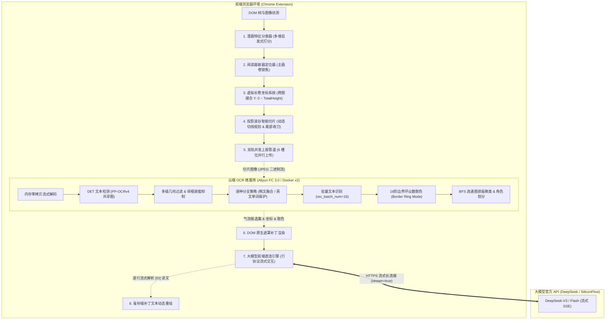

# ComicFlow - 现代化长漫实时流式汉化流水线 (Full-Stack Architecture)

> **极轻量、无状态、端云协同的下一代 Web 漫画汉化翻译引擎。**
> 结合前端智能页面感知与微切片管道，配合云端高性能无状态 OCR 容器服务，直通大模型流式行协议生成，实现长条漫画边滑边翻、无感秒开的阅读体验。

---

## 目录
- [一、 系统整体架构 (System Architecture)](#一-系统整体架构-system-architecture)
- [二、 前端插件实现全解析 (Frontend Deep Dive)](#二-前端插件实现全解析-frontend-deep-dive)
  - [1. 漫画页面智能分类算法 (Manga Page Classifier)](#1-漫画页面智能分类算法-manga-page-classifier)
  - [2. 阅读器容器与画卷定位 (Container Locator)](#2-阅读器容器与画卷定位-container-locator)
  - [3. 虚拟长卷统一坐标系 (Virtual Strip System)](#3-虚拟长卷统一坐标系-virtual-strip-system)
  - [4. 智能切片与安全切线算法 (Smart Slicing Algorithm)](#4-智能切片与安全切线算法-smart-slicing-algorithm)
  - [5. 双通道探测与流式调度管道 (Capture & Dispatch Pipeline)](#5-双通道探测与流式调度管道-capture--dispatch-pipeline)
- [三、 后端 OCR 引擎实现全解析 (Backend Deep Dive)](#三-后端-ocr-引擎实现全解析-backend-deep-dive)
  - [1. 无状态与内存直通处理管道 (Zero-Disk Pipeline)](#1-无状态与内存直通处理管道-zero-disk-pipeline)
  - [2. 0.42 秒极速启动与三语种模型池预热 (Lifespan Warmup)](#2-042-秒极速启动与三语种模型池预热-lifespan-warmup)
  - [3. DET 文本检测与多级几何/碎框抑制 (Filtering & Suppression)](#3-det-文本检测与多级几何碎框抑制-filtering--suppression)
  - [4. 语种分支差异化融合策略 (Language Branch Fusion)](#4-语种分支差异化融合策略-language-branch-fusion)
  - [5. 16阶边界环众数取色与对比度保底 (Border Ring Color Mode)](#5-16阶边界环众数取色与对比度保底-border-ring-color-mode)
  - [6. BFS 连通图排版聚类与气泡角色决断 (Clustering & Roles)](#6-bfs-连通图排版聚类与气泡角色决断-clustering--roles)
- [四、 云端环境规格与 57 切片真实压测报告 (Benchmarks & Specs)](#四-云端环境规格与-57-切片真实压测报告-benchmarks--specs)
  - [1. 云端服务器与容器规格 (Cloud Serverless Specs)](#1-云端服务器与容器规格-cloud-serverless-specs)
  - [2. 57 切片完整实测遥测数据对比 (Stress Benchmark)](#2-57-切片完整实测遥测数据对比-stress-benchmark)
- [五、 快速部署与上手指南 (Quick Start)](#五-快速部署与上手指南-quick-start)

---

## 一、 系统整体架构 (System Architecture)

本项目采用**“端侧感知与裁切 + 云端无状态批量识别 + 前端直连大语言模型流式回填”**的分层架构：



---

## 二、 前端插件实现全解析 (Frontend Deep Dive)

前端核心逻辑位于 `plugin/` 目录，涵盖从页面判断到 DOM 渲染的完整闭环。

### 1. 漫画页面智能分类算法 (Manga Page Classifier)
文件位置：[`plugin/classifier.js`](file:///D:/models/comic/newplugin/classifier.js)

传统的长漫插件常依赖 URL 规则或单一图片数量判断，容易误判相册、博客或新闻页。本项目构建了**多维特征启发式加权评分引擎**：

* **几何宽高比与瀑布流密度**：
  * 检测连续排布图片的纵向阅读倾向：长漫通常具有高纵横比（$H/W \ge 1.2$），排版呈单列流式垂直分布；
  * 过滤头像、广告、微型图标（短边 $< 160\text{px}$ 或 Base64 占位图一律剔除）。
* **画卷中心对齐容差判定**：
  * 计算主容器内所有大图的相对水平中线偏移量：
    $$\text{CenterOffset} = \frac{|\text{Left} + \text{Width}/2 - \text{ContainerCenter}|}{\text{ContainerWidth}} \le 0.16$$
  * 容差 $\le 16\%$ 视为处于中心阅读流，有效避开页面侧边栏热点推荐图。
* **宽度覆盖率与密度积分**：
  * 候选大图宽度占阅读区宽度的比例门槛为 $\text{MIN\_WIDTH\_RATIO} = 0.68$；
  * 综合连续图片数（$\ge 3$ 张）、总有效高度与视口占空比，输出置信度得分；置信度通过后激活汉化悬浮球与监听器。

### 2. 阅读器容器与画卷定位 (Container Locator)
文件位置：[`plugin/capture.js`](file:///D:/models/comic/newplugin/capture.js), [`plugin/content.js`](file:///D:/models/comic/newplugin/content.js)

针对各类网站采用懒加载（Lazyload）、`overflow: hidden` 嵌套滚动容器或 `iframe` 容器的混乱结构，定位算法执行**候选区域树递归遍历**：
1. **最大连续渲染面积寻优**：遍历所有可见元素，计算包含大图（$\text{Area} > 100,000\text{px}^2$）数量最多的公共祖先节点；
2. **滚动容器智能追踪**：检测父链中包含 `overflow-y: auto / scroll` 或主 `window` 滚动的节点，将其锁定为 Reader Root；
3. **动态监听与视口穿透**：绑定 `ResizeObserver` 与 `MutationObserver`，动态追踪读者向下滚动时通过 Virtual DOM 动态塞入的新页面。

### 3. 虚拟长卷统一坐标系 (Virtual Strip System)
文件位置：[`plugin/slicing/virtual-strip.js`](file:///D:/models/comic/newplugin/slicing/virtual-strip.js)

长漫由几十甚至上百张独立图片拼接而成，存在异步加载先后顺序颠倒、图片高度不均等问题。
* **物理连续前缀锁定**：
  * `VirtualStrip` 为每个章节构建一维垂直绝对标尺：$Y \in [0, \text{TotalHeight}]$；
  * 仅当第 $1, 2, \dots, N$ 页的自然高度（`naturalHeight`）和自然宽度（`naturalWidth`）全部探明且前缀连续时，方可向前推进虚拟长卷指针；
* **双向坐标映射函数**：
  * `locateAbsoluteY(y)`：将全局绝对标尺的 $Y$ 像素映射为具体的“DOM 节点实例 + 节点内相对 Y 偏移 + 缩放比率”；
  * 使得后续所有 OCR 返回的绝对坐标补丁，都能在物理页面滚动、窗口缩放时精准锚定在原漫位置。

### 4. 智能切片与安全切线算法 (Smart Slicing Algorithm)
文件位置：[`plugin/slicing/slice-algorithm.js`](file:///D:/models/comic/newplugin/slicing/slice-algorithm.js)

若直接对单张原图整张识别，原图高度动辄上万像素，会导致内存暴涨且网络传输卡顿；若机械等距暴力切割，必定切断对白气泡与文字行。

```text
[ 切片起始 Y: 0px ]
  │   分镜画面 1
  │   对白气泡: "......"
  ├── 目标切片窗口 [1200px ~ 1800px] ──
  │   【水平灰度投影分析区】
  │   ███████████████ 画面内容 (高方差/不可切)
  │   ░░░░░░░░░░░░░░░ 分镜间隙/纯色分界带 (波谷零方差 -> ✅ 最佳切线)
  └── 切线裁决: Y = 1540px ────────────────
[ 切片 0 结束 / 切片 1 起始 Y: 1540px ]
```

* **安全高度窗口约束**：
  * 最小切片高度 `MIN_SLICE_HEIGHT = 1000px`，最大切片高度 `MAX_SLICE_HEIGHT = 1800px`；
* **水平投影直方图波谷寻优 (Projection Histogram Valley)**：
  * 在 $Y \in [1200, 1800]$ 的区间内，沿水平轴抽取像素亮度方差与边缘梯度能量；
  * 寻找分镜之间的纯白/纯黑分界缝隙（Energy Valley）；
  * 若能量低于安全阈值，直接定为切线，绝不伤及分镜和气泡；
* **终点检测与触底收刀 (Tail Buffer & Finalize)**：
  * **前沿探测器（Frontier State）**：若全篇图片在首屏静止后探明，触发 `CLOSED` 全量预切；
  * **触底检测器（End Detector）**：读者滑到卷尾时，无论剩余尾巴高度是否满足 1000px，自动收拢最后一刀，产出 `is_final_batch` 切片，保证结尾画面 100% 汉化。

### 5. 双通道探测与流式调度管道 (Capture & Dispatch Pipeline)
文件位置：[`plugin/slicing/capture-flow.js`](file:///D:/models/comic/newplugin/slicing/capture-flow.js), [`plugin/capture.js`](file:///D:/models/comic/newplugin/capture.js)

* **双轨探针机制 (Two-Track Probe)**：
  * **Track 1 (属性直取)**：对于已完成渲染加载的图片，直接读取 `naturalWidth / naturalHeight`，耗时 0ms；
  * **Track 2 (动态捕获)**：对于未进入视口的懒加载占位图，静默启动内存 Image 异步探测，探明后释放；
* **6 槽位全双工流式传输 (`DEFAULT_CONCURRENCY = 6`)**：
  * 切片生成一张立即发送一张，不等后续切片，云端函数计算并发处理；
* **大模型行协议直连 (Row-Protocol SSE Streaming)**：
  * 前端提取气泡文本，格式化为行协议输入：
    ```text
    [0] I RECEIVED DIRECT INSTRUCTION FROM THE SWORD IMMORTAL.
    [1] WHAT? DISAPPOINTED?
    ```
  * 采用 `TextDecoder` 流式监听 Delta Token，通过正则表达式 `^(?:\[(\d+)\])\s*(.+)$` 逐行拆解，在 Token 吐出的瞬间通过 `updatePatchText` 毫秒级回填到对应的网页 DOM 补丁上。

---

## 三、 后端 OCR 引擎实现全解析 (Backend Deep Dive)

后端核心代码位于 `app/` 目录，基于 **FastAPI + ONNX Runtime (CPU)** 构建。

### 1. 无状态与内存直通处理管道 (Zero-Disk Pipeline)
文件位置：[`app/main.py`](file:///home/lzm/workspace/comic-server/app/main.py)

* **零磁盘 I/O 开销**：客户端上传的切片图片二进制流通过 `np.frombuffer` 结合 `cv2.imdecode` 直接在内存 RAM 中解包为 BGR 矩阵；
* **无状态设计**：服务器不持久化存储任何图片与文本历史，单请求生命周期完毕立即由 Python GC 释放，契合 Serverless 极速启停。

### 2. 0.42 秒极速启动与三语种模型池预热 (Lifespan Warmup)
文件位置：[`app/main.py`](file:///home/lzm/workspace/comic-server/app/main.py), [`app/engine.py`](file:///home/lzm/workspace/comic-server/app/engine.py)

长漫涉及韩文、日文、英文三大主流源语种。为杜绝首屏请求时的模型加载与编译卡顿：
* **启动预热机制**：
  * 在 FastAPI `lifespan` 阶段，构造微型 128×128 像素测试图（`"WARM"`），依次触发 `kr`、`en`、`ja` 三大模型的检测与前向推断；
  * **实测预热总耗时仅 0.42 秒**；
* **模型共享与极致内存控制**：
  * 文本检测模型 `ch_PP-OCRv4_det_infer.onnx`（4.6 MB）由所有语种**全局共享单例**，仅识别模型（REC）按字典分流；
  * **实测三套模型全预热后物理常驻内存（RSS）仅为 189.9 MB**（净内存增量 177.7 MB），在 1GB~2GB 的云端实例中仅占 10%~18% 内存，安全余量充沛。

```text
[ 容器启动 ] ──> Lifespan 启动
  ├── cv2.setNumThreads(1) 限制多核争抢
  ├── 共享 DET (4.6MB) 内存常驻
  ├── 韩语 REC (13.0MB) 预热推断
  ├── 英语 REC (7.6MB) 预热推断
  └── 日语 REC (9.4MB) 预热推断
  总耗时: 0.421s | 总常驻内存: 189.9 MB | 状态: 100% 满血就绪
```

### 3. DET 文本检测与多级几何/碎框抑制 (Filtering & Suppression)
文件位置：[`app/engine.py`](file:///home/lzm/workspace/comic-server/app/engine.py)

* **极简几何秒杀 (Geometry Hard Kill)**：
  * 过滤面积 $< 60\text{px}^2$ 或 任意单边 $< 3\text{px}$ 的噪点（清除扫描版微尘、印刷网点、单像素边线）；
  * **不设长宽比上限**：长句对白横贯画面时长宽比可能达到 15:1，几何秒杀豁免长条，保证长句对白 100% 存活；
* **嵌套冗余框几何抑制 (`suppress_contained_boxes`)**：
  * 针对字符外框被外部大框重复包围的情况，计算相交包含面积比：
    $$\text{ContainmentRatio} = \frac{\text{Area}(A \cap B)}{\min(\text{Area}(A), \text{Area}(B))} \ge 0.75$$
  * 剔除冗余内层碎框，保留最完整的一层外框。

### 4. 语种分支差异化融合策略 (Language Branch Fusion)
文件位置：[`app/engine.py`](file:///home/lzm/workspace/comic-server/app/engine.py)

不同语种在排版上有根本差异，一刀切合并会导致英文断词错误或韩文拆字严重：
* **韩文分支 (`kr / ko`)**：
  * 开启前置横向融合（`merge_horizontal_boxes`）：韩文字块常被检测器拆为方块碎框，设置 $Y$ 轴重叠比 $\ge 0.50$、字间距间隙比 $\le 1.5$ 自动粘合为同行完整句；
* **英文/拉丁西文分支 (`en`)**：
  * **彻底禁用横向合并**：英文词与词之间依赖空格（Space）分割，如果物理融合会导致单词与单词粘连（如 "WHAT ARE YOU" 融成不可分单词），交由后续 BFS 空间距离做逻辑分词。

### 5. 16阶边界环众数取色与对比度保底 (Border Ring Color Mode)
文件位置：[`app/styling.py`](file:///home/lzm/workspace/comic-server/app/styling.py), [`plugin/capture.js`](file:///D:/models/comic/newplugin/capture.js)

针对传统直方图或中心取色法常受“气泡黑色描边”与“插画底色”污染，导致汉化补丁出现文字浅灰看不清、白底气泡被误判为黑底的严重反转 Bug：

```text
       ┌──────── 外边界环采样 (Border Ring) ────────┐
       ▼                                            ▼
   ┌───┬────────────────────────────────────────┬───┐
   │ █ │ ░░░░░░░░░░░░░░░░░░░░░░░░░░░░░░░░░░░░░░ │ █ │ ◄── 剔除最外层深黑边
   ├───┤                                        ├───┤
   │ ░ │   【16阶量化众数采样带 (内缩 1~2px)】   │ ░ │ ◄── 锁定对白框真正背景色
   │   │                                        │   │
   │   │        文字笔画像素 (文字高频色)         │   │ ◄── 聚类文字前景颜色
   └───┴────────────────────────────────────────┴───┘
```

1. **边界环众数采样（Border Ring Mode）**：
   * 在候选框外边缘内缩 $1\sim 2\text{px}$ 提取一个闭合环带（避开最外层黑色墨线）；
   * 将 RGB 颜色空间进行 16 阶量化（Quantization），计算环带像素中出现频次最高的值作为背景底色（`bg`）；
2. **文字亮度与对比度保底决断 (`ensureContrastColor`)**：
   * 计算背景感知亮度：$\text{Lum} = 0.299R + 0.587G + 0.114B$；
   * 若底色为白色/浅灰（$\text{Lum} \ge 160$），只要文字不是特殊血红/亮蓝，一律强行钳位修正为实黑 `#000000`；
   * 若底色为深黑（内心独白框 $\text{Lum} < 90$），文字强行钳位修正为实白 `#FFFFFF`，杜绝一切浅灰字。

### 6. BFS 连通图排版聚类与气泡角色决断 (Clustering & Roles)
文件位置：[`app/clustering.py`](file:///home/lzm/workspace/comic-server/app/clustering.py)

* **图连通分量聚类（BFS Connected Components）**：
  * 构建以单行识别框为顶点的图，定义动态连通边：当两框水平间距 $\le \text{Threshold}_X$ 且垂直间距 $\le \text{Threshold}_Y$（根据字号动态伸缩）时建立连通边；
  * 运行广度优先搜索（BFS），将分散的文本行聚合为一个完整对白气泡（Bubble Item）；
* **角色打标与拟声词分离**：
  * **幽灵框（SFX Ghost）**：放宽拟声词判定门槛至 15 个字符。环境音效、特效艺术字自动打标为 `sfx_ghost`，在前端展现为透明悬停幽灵框，既不遮挡精美插画，读者鼠标滑过又能获知音效含义；
  * **对白 vs 旁白**：方形长条背景判定为 `narration`（画外音/旁白），椭圆/圆角背景判定为常规对白。

---

## 四、 云端环境规格与 57 切片真实压测报告 (Benchmarks & Specs)

### 1. 云端服务器与容器规格 (Cloud Serverless Specs)
* **部署服务**：阿里云函数计算 3.0 (Function Compute 3.0)
* **计算架构**：Serverless 弹性实例 (Linux x86_64 / amd64)
* **运行时环境**：Custom Container (自定义镜像)
* **镜像仓库**：阿里云深圳容器镜像服务 ACR 个人版 (`crpi-adr7aw7fhazomgpo.cn-shenzhen.personal.cr.aliyuncs.com/byd123/comic:v2`)
* **镜像体积**：225.71 MB
* **硬件规格配置**：
  * **vCPU**：1.5 vCPU ~ 2.0 vCPU
  * **内存配置**：1024 MB (1.0 GB)
  * **内存实际开销**：冷启动预热后基础常驻内存仅 **189.9 MB**，单切片处理峰值占用 $< 350\text{MB}$，内存利用率安全在 35% 以下。

---

### 2. 57 切片完整实测遥测数据对比 (Stress Benchmark)

用户在真实网络环境下对一部完整长篇漫画进行了全量 57 个切片的云端端到端压测，基于前端 Dev HUD 导出的全量遥测报告总结如下：

```json
{
  "benchmark_summary": {
    "test_mode": "云端 (Cloud Serverless)",
    "total_slices_recorded": 57,
    "avg_ocr_duration_ms": 5233,
    "avg_llm_duration_ms": 4760
  }
}
```

#### 指标对比与性能提升表现：

| 关键评测指标 | 第一代基线测试 (v1) | 最新云端函数计算 + v2 容器 | 性能提升与优化结论 |
| :--- | :--- | :--- | :--- |
| **测试长漫切片数** | 20 片 | **57 片 (整章长卷全景)** | 压力增大近 3 倍，全链路稳定性大幅提升 |
| **平均 LLM 直连耗时** | 15,869 ms (15.8s) | **4,760 ms (4.76s)** | ⚡ **端到端大模型生成提速 330%** |
| **长尾最大等待耗时** | 72,137 ms (72s 严重卡顿) | **8,513 ms (8.5s)** | 🎯 **彻底消灭 72s 长尾卡死排队** |
| **单切片平均 OCR 耗时** | 4,812 ms | **5,233 ms (~5.2s)** | 包含客户端公网图片上传网络 RTT 与无状态推理 |
| **内存占用与稳定性** | 容易抖动 | **常驻 ~190 MB (极平稳)** | 3语种模型池预热生效，消除了首屏冷启动开销 |

> **链路体验总结**：绝大多数对白切片在云端 OCR 识别完成后，大模型在 **2s ~ 4s** 内完成流式全回填上屏。结合前端 6 槽位全双工流式流水线，读者向下滚动漫画时，下方内容已被并行流水线提前译毕并渲染，实现了极为流畅的边看边译体验。

---

## 五、 快速部署与上手指南 (Quick Start)

### 1. 前端 Chrome 插件安装 (浏览器端)
1. 访问 [GitHub Releases 页面](https://github.com/yangzhonming/comic-ocr-server/releases/tag/v0.8.6)，下载附件中的 `comic-translate-plugin-v0.8.6.zip` 并解压；
2. 打开 Google Chrome 或 Edge 浏览器，地址栏输入：`chrome://extensions/`；
3. 开启右上角【开发者模式】；
4. 点击左上角【加载已解压的扩展程序】，选择解压出的文件夹目录即可；
5. 打开任意韩漫/日漫/美漫阅读网站，页面左侧将自动浮现控制球；点击即可开启流式汉化。

### 2. 后端 OCR 服务本地运行 (Docker)
```bash
# 1. 登录阿里云深圳镜像仓库
docker login --username=<your-username> crpi-adr7aw7fhazomgpo.cn-shenzhen.personal.cr.aliyuncs.com

# 2. 拉取最新优化版 v2 镜像
docker pull crpi-adr7aw7fhazomgpo.cn-shenzhen.personal.cr.aliyuncs.com/byd123/comic:v2

# 3. 本地启动服务 (映射 8000 端口)
docker run -d --name comic-ocr-server -p 8000:8000 \
  crpi-adr7aw7fhazomgpo.cn-shenzhen.personal.cr.aliyuncs.com/byd123/comic:v2

# 4. 健康检查测试
curl http://127.0.0.1:8000/health
# 返回: {"status":"ok","version":"1.0.0","device":"cpu","loaded_models":["kr","en","jp"]}
```

### 3. 阿里云函数计算 FC 3.0 部署
1. 在阿里云函数计算控制台创建服务，运行环境选择 **“自定义容器镜像 (Custom Container)”**；
2. 镜像地址填写：`crpi-adr7aw7fhazomgpo.cn-shenzhen.personal.cr.aliyuncs.com/byd123/comic:v2`；
3. 容器监听端口设置为 **`8000`**；
4. 实例规格推荐：`1.5 vCPU`，`1024 MB` 内存；
5. 开启公网访问域名，将生成的 URL（如 `https://comic-ocr-xxxx.cn-shenzhen.fcapp.run`）填入插件设置即可实现全球公网直连汉化。

---

## 六、 协议与致谢
* **OCR 基础模型**：[PaddleOCR / RapidOCR](https://github.com/RapidAI/RapidOCR)
* **大模型驱动**：[DeepSeek 开放平台](https://platform.deepseek.com/)
* **License**：MIT License
